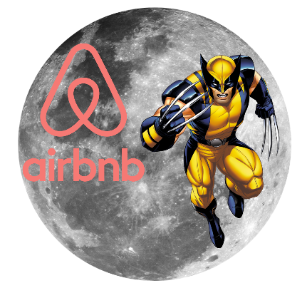
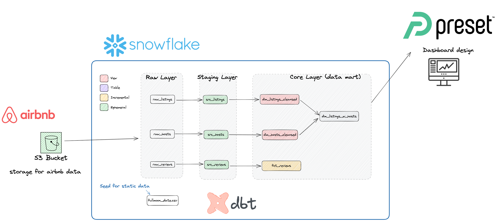

# Full Moon 
Anlysis customer sentiment analysis and study the effect of the full moon on customers' mood! (Hopefully our customers don't turn on wolverine mode and leave a bad review!)

# Motivation

The motivation of the project is to perform a sentiment ananlysis on airbnb public dataset. The goal of this project is to:
- investigate the effect of fullmoon on the customered mood, characterized by the reviews they left for the airbnb listings.
- get some practice in for [dbt](https://docs.getdbt.com/)


# Tech-stack involved





# Installation

```bash
# create a project directory for the dbt project
dbt init <ProjectName>
```


# Reference
- [complete dbt course github](https://github.com/nordquant/complete-dbt-bootcamp-zero-to-hero)