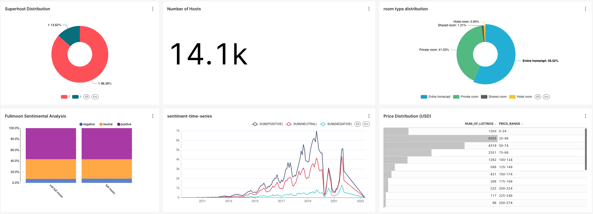

# Full Moon 
Airbnb customer sentiment analysis and study the effect of the full moon on customers' mood! (Hopefully our customers don't turn on wolverine mode and leave a bad review!) Just kidding, I also study more serious metrics such as price distribution and reviewer seasonality.

# Motivation

The motivation of the project is to perform a sentiment analysis on airbnb public dataset. The goal of this project is to:
- investigate the effect of full moon on the customers' mood, measured by the reviews they left for the airbnb listings (sorry, i just really enjoy these silly questions since it's so fun)
- get some practice in for [dbt](https://docs.getdbt.com/), which from my point of view, would become a necessity.


# Pipeline Architecture

The data uses the ELT paradigm instead of ETL paradigm and the overall process involves
- `extraction`: extract data from s3 bucket from airbnb
- `load`: load into the snowflake first
- `transformation`: apply basic cleaning, testing and business-logics transformation with `dbt`
- `BI`: Business intelligence on the data mart

The overall pipeline architecture is illustrated in the figure below


*overall architecture for the airbnb project*

The final deliverable for the project is a dashboard designed with [Preset](https://preset.io/) for making dashboard, the following metrics are investigated:
- percentage of superhost (hightly-rated host)
- total number of hosts airbnb have
- room type distribution
- sentiment analysis over the year
- listing price distribution
- investigate the effect of full moon on customer's mood (this is for fun!)




# Installation

In this section, i will cover how to set up the `dbt` and `snowflake`. As for set up `Preset`, please refer [here](./dashboard/README.md).
## Snowflake set-up

General steps are here
1. register for 30-days free trial on website
2. connect snowflake account with dbt
3. run a snowflake SQL datasheet to create databse user, [click here](./setup/2_create_users.sql).
4. run a snowflake SQL datasheet to import data from s3, [click here](./setup/1_import_airbnb_data_to_snowflake.sql). 


## dbt setup

Let's install `dbt` and dbt-snowflake adapeter via `pip`

```bash
# create project dir
mkdir project && cd project
# install python 3.11
python3.11 -m venv .venv

# depends on whether you use bash, zsh or fish
source .venv/bin/activate

# now you are in the python environment, let's install package
# dbt-snowflake==1.5.0
# dbt-core==1.5.1
pip install -r requirements.txt
```

Now, you have dbt up and running locally 
```bash
# check if dbt is installed and version
dbt --version
```
The output should be 

```plaintext
Core:
  - installed: 1.5.1
  - latest:    1.5.1 - Up to date!

Plugins:
  - snowflake: 1.5.0 - Update available!

  At least one plugin is out of date or incompatible with dbt-core.
  You can find instructions for upgrading here:
  https://docs.getdbt.com/docs/installation
```

```bash
# create a project directory for the dbt project
dbt init <ProjectName>
```

Now you should have a dbt project directories like `tree -L 1`, 
```bash
.
├── README.md
├── analyses
├── dbt_packages
├── dbt_project.yml
├── logs
├── macros
├── models
├── seeds
├── snapshots
├── target
└── tests
10 directories, 2 files
```

Now we need to install dbt-packages to make our life easier, [dbthub here](https://hub.getdbt.com/). You could find [dbt_utils on dbthub](https://hub.getdbt.com/dbt-labs/dbt_utils/latest/) and [dbt_utils github repo](https://github.com/dbt-labs/dbt-utils).

Create a `packages.yml` file in your dbt project folder and echo in this to `packages.yml`
```yml
packages:
  - package: dbt-labs/dbt_utils
    version: 1.1.0
```

Then run it 
```bash
# build dependencies
dbt deps

# output
20:12:11  Running with dbt=1.5.1
20:12:11  Installing dbt-labs/dbt_utils
20:12:12  Installed from version 1.1.0
20:12:12  Up to date!
```
Now you are good to do!


# Reference
