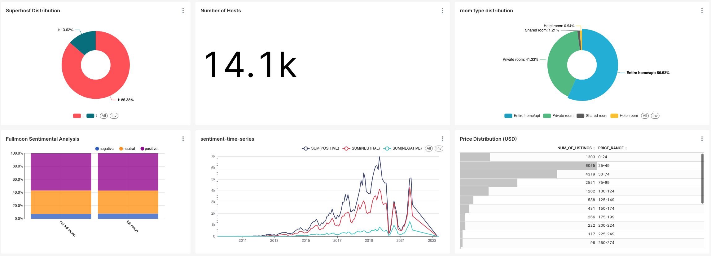

# Airbnb Dashboard Design with Preset

The dashboard design tool used for this airbnb project is powered with the [Preset](https://preset.io/) data visualization tool. Preset is a powerful and easy-to-use dashboard design tool that allows you to create beautiful and functional dashboards in minutes.

Well, it's a pretty ez to use BI tools, me like it.

## Features

- Interactive charts and graphs
- Customizable color schemes and branding
- Real-time data updates
- Easy integration with popular data sources

## Getting Started

To get started with Preset, simply sign up for an account and start exploring the dashboard templates and design options. You can choose from a variety of chart types, including bar charts, line charts, and pie charts.

The general workflows are:
- connect to your database such as snowflake 
- import dataset 
- write some SQL queries to aggregate info
- create chart
- throw charts into dashboard

## Dashboard layout

The dashboard has the following components:

|graph name|graph type|-|
|---|---|---|
|superhost distribution|pie chart|[here](./scripts/superhost_ratio.sql)|
|number of hosts|just an aggregated number|N/A|
|room type distribution|pie chart|[here](./scripts/roomtype.sql)|
|fullmoon analysis|stacked bar|did it in `dbt` as a datamart, link [here](../dbtlearn/models/mart/mart_fullmoon_reviews.sql)|
|listing price distribution|bar|[here](./scripts/num_of_listing_price.sql)|

