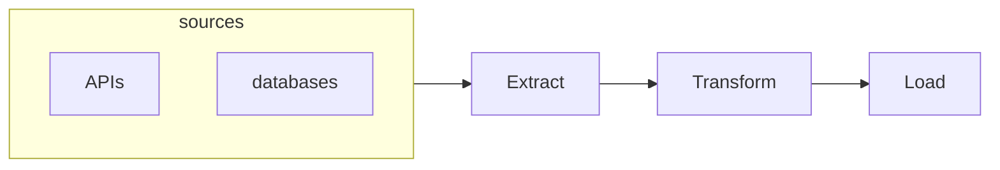

# Project: Airbnb's Under Full Moon 

*Table of contents*
- [Project: Airbnb's Under Full Moon](#project-airbnbs-under-full-moon)
- [2 Theory - The Data Maturity Model](#2-theory---the-data-maturity-model)
  - [ETL](#etl)
  - [ELT](#elt)
  - [Summary](#summary)
- [3 Theory Data Warehouses, Data Lakes, and Lakehouses](#3-theory-data-warehouses-data-lakes-and-lakehouses)
  - [Data warehouse](#data-warehouse)
  - [Data lake](#data-lake)
  - [Data lakehouse](#data-lakehouse)
- [4. The Modern Data Stack](#4-the-modern-data-stack)
  - [SMP](#smp)
  - [MPP](#mpp)
  - [Compute and Storage](#compute-and-storage)
  - [Summary](#summary-1)
- [5. Slowly Changing Dimension (SCD)](#5-slowly-changing-dimension-scd)
- [6 dbt](#6-dbt)
  - [What's dbt?](#whats-dbt)
  - [Project](#project)
    - [Project requirements](#project-requirements)
    - [Set-up](#set-up)
- [8. Models](#8-models)
  - [Models Overview](#models-overview)
- [9 Materialization](#9-materialization)
  - [Materialization Overview](#materialization-overview)
- [10 Seeds and Sources](#10-seeds-and-sources)
  - [Seeds](#seeds)
  - [Sources](#sources)
  - [Sources Freshness](#sources-freshness)


# 2 Theory - The Data Maturity Model

The pyramid from bottom to top
- data collection
- data wrangling 
- data integration
- BI and Analytics
- Artificial Intelligence


- `Data collection`: extracts data from different sources. It can comes in different way.
- `Data Wrangling`:
- `Data Integration`: load into a data warehouse for business analyst to draw data from


## ETL


Due to perpetual license and single node computing limitation of a database, it makes sense for us to extract the data outside of the database, to perform transformation before we load it into a database.

The schematics is shown here



Some overhead of ETL
- testing and debugging 
- hook up new data collection takes time

## ELT


## Summary
Extract, transform and load, let's load into warehouse first 

|-|ETL|ELT|
|---|---|---|
|Description|data integration process that involves extracting data from multiple sources, transforming it into a structured format, and loading it into a target system. |extracting data from multiple sources, loading it into a target system, and then transforming it into a structured format.|
|History|Transformation has been done outside of database due to limitation of single node computing inside database.|Thanks to data warehouse (big query, red shift and snowflake) It has great scalability.|
|应用场景|data is transformed outside database. This approach can be useful when dealing with large amounts of data or when transforming data into complex, structured formats.|data is loaded into a target system before being transformed. This approach can be useful when dealing with simple transformations or when working with target systems that are optimized for data processing.|


# 3 Theory Data Warehouses, Data Lakes, and Lakehouses

For structured data, go to data warehouse

## Data warehouse 


Data warehouse: 
- used for reporting and dashboarding purpose
- doing analytics engineering on top of it
- used to be on-prem based (oracle, IBM) to cloud-based (redshift, big query snowflake)
  - on-prem when scale-up needed, do the following
    - purchase new computing power
    - hardware maintenance
- as


## Data lake


## Data lakehouse


|  | Data Warehouse | Data Lake | Data Lakehouse |
| --- | --- | --- | --- |
| Definition | A centralized repository for structured data. | A centralized repository for raw, unstructured, and semi-structured data. | A hybrid approach that combines elements of both data warehouse and data lake architectures. |
| Schema | Structured | Unstructured | Schema-on-read |
| Data Type | Structured | Semi-structured and Unstructured | Structured, Semi-structured, and Unstructured |
| Data Processing | Batch processing | Batch, Micro-batch, and Stream processing | Batch, Micro-batch, and Stream processing |
| Data Access | SQL-based | SQL, NoSQL, and Object storage | SQL, NoSQL, and Object storage |
| Data Governance | High | Low | High |
| Scalability | Vertical | Horizontal | Both |


> `Vertical scaling` refers to increase the capacity of a single machine by giving more resources (cpu, memory, storage). While `Horizontal scaling` refers to adding more machines.


# 4. The Modern Data Stack

|Year|Size|Cost (USD)|
|---|---|---|
|1967|1 MB|1,000,000|
|1981|1 GB|300,000|
|1994|1 GB|1000|
|2000|1 GB|10|


Three things are the main driver:
- storage prices continues to drop
- Transistor prices continues to drop
- Faster data transmission over the network 


We are shifting from `SMP Data warehouse` to `MPP Cloud Data Warehouse`

## SMP 

SMP stands for `Symmetric Multi-Processing`, which refers to a type of data warehouse architecture that uses multiple processors to share the processing workload. In an SMP architecture, all processors have equal access to memory and I/O resources, allowing them to work together to process data more efficiently. This approach can be effective for small to medium-sized data warehouses that require occasional performance boosts. However, SMP architectures may not be as scalable as other architectures, such as MPP or cloud-based architectures, which can provide greater processing power and scalability for larger data warehouses.


## MPP

MPP, which stands for `Massively Parallel Processing`, is a type of data warehouse architecture that uses multiple processors to share the processing workload. In an MPP architecture, data is distributed across multiple nodes, each of which has its own processor, memory, and storage. This allows MPP systems to scale horizontally by adding more nodes to the cluster, allowing them to handle larger workloads. MPP architectures are often used for large-scale data warehousing applications that require high levels of performance and scalability.

主要原因，还是network speed上升了很多，可以用MPP architecture了


In MPP, 
- shared-nothing architecture
- shared-disk architecture


## Compute and Storage

We are decoupling computing with storage so we can scale up each part on-demand.


## Summary

|-|old data stack|modern data stack|
|---|---|---|
|-|row-oriented database (such as mysql and postgres for OLTP)|column-oriented database (for OLAP)|
|-|SMP architecture|MPP architecture|
|-|compute with storage|decouple storage with compute (in data warehouse)|


# 5. Slowly Changing Dimension (SCD)

The concept of SCD has been proposed by Ralph Kimball, a prominent figure in the field of data warehousing and business intelligence. He is known for his work on dimensional modeling, which is a technique used to design databases for data warehousing. Kimball is the author of several books on data warehousing, including "The Data Warehouse Toolkit" and "The Kimball Group Reader." He has also founded several consulting firms that specialize in data warehousing and business intelligence.

| SCD Type | Description | Use Case |
| --- | --- | --- |
| 1 | Overwrites existing data with new data | Historical data is not important |
| 2 | Adds new records to the dimension table to reflect changes over time | Historical data is important |
| 3 | Adds new columns to the dimension table to reflect changes over time | Only a subset of historical data is important |


# 6 dbt

## What's dbt?

> `dbt`: it is the T of ELT or ELT. Production-level data pipeline with all software engineering best practice such as version control, CI/CD, testing and documentation.


## Project

- simulating the life of an analytics engineer in Airbnb
- Loading, cleansing and exposing data
- Writing test, automations and documentation
- Data source: inside Airbnb, Berlin


### Project requirements

- modeling changes are easy to follow and revert
- Explicit dependencies between models
- Explore dependencies between models
- Data quality tests
- Error reporting
- Incremental load of fact tables
- Track history of dimension tables
- Ez-to-access documentation

### Set-up
- snowflake registration
- dataset import
- dbt installation
- dbt setup, snowflake connection


# 8. Models

Overview of this section
- Understand the data flow of our project
- Understand the concept of Models in dbt
- Create three basic models:
  - `src_listings`
  - `src_reviews`: guided exercises
  - `src_hosts`: individual lab


## Models Overview


In dbt, a model is a SQL query that defines a table or view in your database. Models can be created using SQL code, and can include references to other models, macros, and variables.

dbt compiles models into SQL queries that can be run against your database. When you run `dbt run`, dbt will execute the compiled SQL queries to create or update the tables and views defined by your models.

Models in dbt can be organized into folders and subfolders, allowing you to group related models together and organize your project structure.

Models in dbt can also be tested using assertions. Assertions allow you to define expected results for your models, and dbt will automatically test your models against these expectations when you run `dbt test`.


- Models in dbt are the basic building block of your business logic
- Materialized as tables 


# 9 Materialization

In this section, we will talk about
- Understand how models can be connected
- Understand the four built-in materializations
- Understand how materializations can be configured on the file and project level
- Use **dbt** with extra parameters

In the SQL world, **materialization** refers to the process of creating a physical table or view in a database from the results of a SQL query. Materialization is used to improve query performance by storing the results of a query in a table or view, which can then be accessed more quickly than re-executing the query every time it is needed.

Materialization can be done in a variety of ways, depending on the database system and the type of query being executed. Common techniques include:

- Creating a temporary table to store the query results
- Creating a materialized view, which is a precomputed table that is automatically updated when the underlying data changes
- Creating a permanent table to store the query results

Materialization can be an effective way to improve query performance, especially for complex queries that involve large amounts of data. However, it can also be resource-intensive, especially for queries that are executed frequently or involve large amounts of data. As with any performance optimization, it is important to carefully evaluate the trade-offs and test the impact of materialization on query performance and resource usage.

## Materialization Overview

In dbt, it is similar to 

|  | View | Table | Incremental Tables | Ephemeral Tables |
| --- | --- | --- | --- | --- |
| Use it | you want a lightweight representation | you read from this model repeatedly | fact tables; appends to tables | you merely want an alias to your date  |
| Don't use it | you read from the same model several times | building single-use models; your model is populated incrementally | you want to update historical records | you read from the same model several times |


Materialization set up in dbt is [here](https://docs.getdbt.com/docs/build/materializations).


```yaml
# file structure for the model/
.
├── dim
│   ├── dim_hosts_cleansed.sql
│   └── dim_listings_cleansed.sql
└── src
    ├── src_hosts.sql
    ├── src_listings.sql
    └── src_reviews.sql

# yaml file

name: 'dbtlearn'
version: '1.0.0'
config-version: 2


models:
  dbtlearn:
    +materialized: view # project设置默认的materialzed为view
    dim:
      +materialized: table # 设置dim/内的默认materialized方法为 table

```


# 10 Seeds and Sources

Overview, in this section we will cover
- Understand the difference between seeds and sources
- Understand source-freshness
- Integrate sources into our project


## Seeds

A **source** is a table or view that is used to pull data into a dbt project. Sources are typically read-only, and are used as inputs for models. 

**Seeds**, on the other hand, are initial data sets that are loaded into a dbt project. Seeds are typically used to provide static reference data or to bootstrap a project with initial data. Unlike sources, seeds can be modified or updated over time.


- seeds are local files that you upload to the data warehouse from dbt
- sources is an abstraction layer on the input tables
- source freshness can be checked automatically 


## Sources


## Sources Freshness
