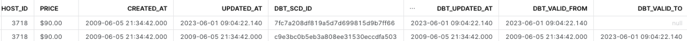

# Project: Airbnb's Under Full Moon 

*Table of contents*
- [Project: Airbnb's Under Full Moon](#project-airbnbs-under-full-moon)
- [Overview](#overview)
- [2 Theory - The Data Maturity Model](#2-theory---the-data-maturity-model)
  - [ETL](#etl)
  - [ELT](#elt)
  - [Summary](#summary)
- [3 Theory Data Warehouses, Data Lakes, and Lakehouses](#3-theory-data-warehouses-data-lakes-and-lakehouses)
  - [Data warehouse](#data-warehouse)
  - [Data lake](#data-lake)
  - [Data lakehouse](#data-lakehouse)
- [4. The Modern Data Stack](#4-the-modern-data-stack)
  - [Driver for the changes](#driver-for-the-changes)
  - [SMP](#smp)
  - [MPP](#mpp)
  - [Compute and Storage](#compute-and-storage)
  - [Summary](#summary-1)
- [5. Slowly Changing Dimension (SCD)](#5-slowly-changing-dimension-scd)
- [6 dbt](#6-dbt)
  - [What's dbt?](#whats-dbt)
  - [Project](#project)
    - [Project requirements](#project-requirements)
    - [Set-up](#set-up)
- [8. Models](#8-models)
  - [Models Overview](#models-overview)
- [9 Materialization](#9-materialization)
  - [Materialization in SQL](#materialization-in-sql)
  - [Materialization in dbt](#materialization-in-dbt)
- [10 Seeds and Sources](#10-seeds-and-sources)
  - [Seeds](#seeds)
  - [Sources](#sources)
  - [Sources freshness](#sources-freshness)
- [11 Snapshot](#11-snapshot)
  - [What's snapshot?](#whats-snapshot)
  - [SCD Type 2 recap](#scd-type-2-recap)
  - [Lab: creating a snapshots](#lab-creating-a-snapshots)
- [12 Tests](#12-tests)
  - [Tests Overview](#tests-overview)
  - [Generic Tests](#generic-tests)
  - [Singular Tests](#singular-tests)
- [13 Macros, Custom Tests, and Packages](#13-macros-custom-tests-and-packages)
  - [Macros Overview](#macros-overview)
  - [Lab: Creating macro](#lab-creating-macro)
  - [Lab: Writing Custom Generic Tests](#lab-writing-custom-generic-tests)
  - [Lab: Installing third-party packages](#lab-installing-third-party-packages)
- [14 Documentation](#14-documentation)
- [15 Analyses, Hooks and Exposures](#15-analyses-hooks-and-exposures)
- [16 dbt Hero](#16-dbt-hero)
- [17 Debugging tests and testing with dbt-expectations](#17-debugging-tests-and-testing-with-dbt-expectations)

# Overview

The goal of this project is to
- Understand the history of data stack and why the transition happens
- Understand how `dbt` fits in the modern data stack
- Deep dive into different features of `dbt`


# 2 Theory - The Data Maturity Model

Let's use the pyramid model to understand the data industry from bottom to top
- data collection
- data wrangling 
- data integration
- BI and Analytics
- Artificial Intelligence


More detailed definition are
- `Data collection`: extracts data from different sources. It can comes in different way.
- `Data Wrangling`:
- `Data Integration`: load into a data warehouse for business analyst to draw data from


## ETL


Due to perpetual license and single node computing limitation of a database back in 1980s, it makes sense for us to extract the data outside of the database, and then to perform transformation before we load it into a database.

The schematics is shown here


Some overhead of ETL
- testing and debugging 
- hook up new data collection takes time

## ELT

ELT is a more modern approach that you load the data in the data warehouse and then do the necessary transformation inside the data warehouse.


## Summary
Extract, transform and load, let's load into warehouse first 

|-|ETL|ELT|
|---|---|---|
|Description|data integration process that involves extracting data from multiple sources, transforming it into a structured format, and loading it into a target system. |extracting data from multiple sources, loading it into a target system, and then transforming it into a structured format.|
|History|Transformation has been done outside of database due to limitation of single node computing inside database.|Thanks to data warehouse (big query, red shift and snowflake) It has great scalability.|
|应用场景|data is transformed outside database. This approach can be useful when dealing with large amounts of data or when transforming data into complex, structured formats.|data is loaded into a target system before being transformed. This approach can be useful when dealing with simple transformations or when working with target systems that are optimized for data processing.|


# 3 Theory Data Warehouses, Data Lakes, and Lakehouses

Let's understand those terminology and why does it exist
- data warehouse
- datalake
- data lakehouse

## Data warehouse 


Data warehouse is summarized into the following points: 
- used for reporting and dashboarding purpose
- doing analytics engineering on top of it
- used to be on-prem based (oracle, IBM) to cloud-based (redshift, big query snowflake)
  - on-prem when scale-up needed, do the following
    - purchase new computing power
    - hardware maintenance


## Data lake

placeholder


## Data lakehouse


|  | Data Warehouse | Data Lake | Data Lakehouse |
| --- | --- | --- | --- |
| Definition | A centralized repository for structured data. | A centralized repository for raw, unstructured, and semi-structured data. | A hybrid approach that combines elements of both data warehouse and data lake architectures. |
| Schema | Structured | Unstructured | Schema-on-read |
| Data Type | Structured | Semi-structured and Unstructured | Structured, Semi-structured, and Unstructured |
| Data Processing | Batch processing | Batch, Micro-batch, and Stream processing | Batch, Micro-batch, and Stream processing |
| Data Access | SQL-based | SQL, NoSQL, and Object storage | SQL, NoSQL, and Object storage |
| Data Governance | High | Low | High |
| Scalability | Vertical | Horizontal | Both |


> **Tip**
>
> `Vertical scaling` refers to increase the capacity of a single machine (node) by giving more resources (cpu, memory, storage). While `Horizontal scaling` refers to adding more machines.


# 4. The Modern Data Stack

Let's take a look at the main driver behind the "upgrade" for data stack.


## Driver for the changes

|Year|Size|Cost (USD)|
|---|---|---|
|1967|1 MB|1,000,000|
|1981|1 GB|300,000|
|1994|1 GB|1000|
|2000|1 GB|10|


Three things are the main driver:
- storage prices continues to drop
- Transistor prices continues to drop
- Faster data transmission over the network 

> **Note**
> 
> tech stack的产生和技术的革新，都是随着时代的产物, 随着开采原材料成本降低，transistor成本降低，单位容量的硬盘成本降低，算力的提升，这一切都促进了tech stack从on-prem往cloud进行迁移的原因. 同理，为什么elt能feasible的原因，也是因为算力和储存成本降低了. 随着各种云服务变多，需求变大，自然infrastructure as a code, terraform也应运而生，都是为了解决complexity而应运而生的产物.

We are shifting from `SMP Data warehouse` to `MPP Cloud Data Warehouse`

## SMP 

SMP stands for `Symmetric Multi-Processing`, which refers to a type of data warehouse architecture that uses multiple processors to share the processing workload. In an SMP architecture, all processors have equal access to memory and I/O resources, allowing them to work together to process data more efficiently. This approach can be effective for small to medium-sized data warehouses that require occasional performance boosts. However, SMP architectures may not be as scalable as other architectures, such as MPP or cloud-based architectures, which can provide greater processing power and scalability for larger data warehouses.


## MPP

MPP, which stands for `Massively Parallel Processing`, is a type of data warehouse architecture that uses multiple processors to share the processing workload. In an MPP architecture, data is distributed across multiple nodes, each of which has its own processor, memory, and storage. This allows MPP systems to scale horizontally by adding more nodes to the cluster, allowing them to handle larger workloads. MPP architectures are often used for large-scale data warehousing applications that require high levels of performance and scalability.

主要原因，还是network speed上升了很多，可以用MPP architecture了


In MPP, 
- shared-nothing architecture
- shared-disk architecture


## Compute and Storage

We are decoupling computing with storage so we can scale up each part on-demand.


## Summary

|-|old data stack|modern data stack|
|---|---|---|
|-|row-oriented database (such as mysql and postgres for OLTP)|column-oriented database (for OLAP)|
|-|SMP architecture|MPP architecture|
|-|compute with storage|decouple storage with compute (in data warehouse)|


# 5. Slowly Changing Dimension (SCD)
The concept of SCD has been proposed by Ralph Kimball, a prominent figure in the field of data warehousing and business intelligence. He is known for his work on dimensional modeling, which is a technique used to design databases for data warehousing. Kimball is the author of several books on data warehousing, including "The Data Warehouse Toolkit" and "The Kimball Group Reader." He has also founded several consulting firms that specialize in data warehousing and business intelligence.

| SCD Type | Description | Use Case |
| --- | --- | --- |
| 1 | Overwrites existing data with new data | Historical data is not important |
| 2 | Adds new records to the dimension table to reflect changes over time | Historical data is important |
| 3 | Adds new columns to the dimension table to reflect changes over time | Only a subset of historical data is important |

Whether the historical data would be important is totally dependent on the business logics. Let's say for the airbnb project.

Let's start with an example:
- `SCD 1`:


# 6 dbt

## What's dbt?

> `dbt`: it is the T of ELT or ELT. Production-level data pipeline with all software engineering best practice such as version control, CI/CD, testing and documentation.


## Project

- simulating the life of an analytics engineer in Airbnb
- Loading, cleansing and exposing data
- Writing test, automations and documentation
- Data source: inside Airbnb, Berlin


### Project requirements

- modeling changes are easy to follow and revert
- Explicit dependencies between models
- Explore dependencies between models
- Data quality tests
- Error reporting
- Incremental load of fact tables
- Track history of dimension tables
- Ez-to-access documentation

### Set-up
- snowflake registration
- dataset import
- dbt installation
- dbt setup, snowflake connection


# 8. Models

Overview of this section
- Understand the data flow of our project
- Understand the concept of Models in dbt
- Create three basic models:
  - `src_listings`
  - `src_reviews`: guided exercises
  - `src_hosts`: individual lab


## Models Overview


In dbt, a model is a SQL query that defines a table or view in your database. Models can be created using SQL code, and can include references to other models, macros, and variables.

dbt compiles models into SQL queries that can be run against your database. When you run `dbt run`, dbt will execute the compiled SQL queries to create or update the tables and views defined by your models.

Models in dbt can be organized into folders and subfolders, allowing you to group related models together and organize your project structure.

Models in dbt can also be tested using assertions. Assertions allow you to define expected results for your models, and dbt will automatically test your models against these expectations when you run `dbt test`.


- Models in dbt are the basic building block of your business logic
- Materialized as tables 


# 9 Materialization

In this section, we will talk about
- Understand how models can be connected
- Understand the four built-in materializations
- Understand how materializations can be configured on the file and project level
- Use **dbt** with extra parameters


## Materialization in SQL

In the SQL world, **materialization** refers to the process of creating a physical table or view in a database from the results of a SQL query. Materialization is used to improve query performance by storing the results of a query in a table or view, which can then be accessed more quickly than re-executing the query every time it is needed.

> **Note**
>
> The initiative behind materialization is trade-off between time and space. (remind u of leetcode again huh) 


Materialization can be done in a variety of ways, depending on the database system and the type of query being executed. Common techniques include:

- Creating a temporary table to store the query results
- Creating a materialized view, which is a precomputed table that is automatically updated when the underlying data changes
- Creating a permanent table to store the query results

Materialization can be an effective way to improve query performance, especially for complex queries that involve large amounts of data. However, it can also be resource-intensive, especially for queries that are executed frequently or involve large amounts of data. As with any performance optimization, it is important to carefully evaluate the trade-offs and test the impact of materialization on query performance and resource usage.

## Materialization in dbt

In dbt, it is similar to 

|  | View | Table | Incremental Tables | Ephemeral Tables |
| --- | --- | --- | --- | --- |
| Use it | you want a lightweight representation | you read from this model repeatedly | fact tables; appends to tables | you merely want an alias to your date  |
| Don't use it | you read from the same model several times | building single-use models; your model is populated incrementally | you want to update historical records | you read from the same model several times |


Materialization set up in dbt is [here](https://docs.getdbt.com/docs/build/materializations).


```yaml
# file structure for the model/
.
├── dim
│   ├── dim_hosts_cleansed.sql
│   └── dim_listings_cleansed.sql
└── src
    ├── src_hosts.sql
    ├── src_listings.sql
    └── src_reviews.sql

# yaml file

name: 'dbtlearn'
version: '1.0.0'
config-version: 2


models:
  dbtlearn:
    +materialized: view # project设置默认的materialzed为view
    dim:
      +materialized: table # 设置dim/内的默认materialized方法为 table

```


# 10 Seeds and Sources

Overview, in this section we will cover
- Understand the difference between seeds and sources
- Understand source-freshness
- Integrate sources into our project


## Seeds

A **source** is a table or view that is used to pull data into a dbt project. Sources are typically read-only, and are used as inputs for models. 

**Seeds**, on the other hand, are initial data sets that are loaded into a dbt project. Seeds are typically used to provide static reference data or to bootstrap a project with initial data. Unlike sources, seeds can be modified or updated over time.

> `Note`
>
> Seed是一种reference table, 主要负责static or infrequently changed data, like country codes or [热力学参数look-up](https://ntrs.nasa.gov/citations/20020085330)

- seeds are local files that you upload to the data warehouse from dbt
- sources is an abstraction layer on the input tables
- source freshness can be checked automatically 

Doing seeds in dbt is simple, first you copy the csv file you wish to use as seed to the seed directory in the `dbt_project.yml` file
```yaml
name: 'dbtlearn'
version: '1.0.0'
config-version: 2

profile: 'dbtlearn'

model-paths: ["models"]
analysis-paths: ["analyses"]
test-paths: ["tests"]
seed-paths: ["seeds"] # seed path
macro-paths: ["macros"]
snapshot-paths: ["snapshots"]
```

And you copy over the file to the seed directory
```bash
seeds/
└── seed_full_moon_dates.csv

1 directory, 1 file
```
And then you run
```bash
dbt seed
```

> **Note**
>
> Schema for dbt seed is inferred when sending it to snowflake.


In summary, seed are
- initial boilerplate data for the project or external table


## Sources

Source is defined in the `sources.yml` file

```yml
# define the source configuration
# the main benefit is once defined, we could just 
# change the source
version: 2

sources:
  - name: airbnb
    schema: raw
    tables:
      - name: listings
        identifier: raw_listings
      
      - name: hosts
        identifier: raw_hosts

      - name: reviews
        identifier: raw_reviews
        loaded_at_field: date
```


## Sources freshness

Source freshness解决的问题是，DE经常需要确认数据是否在正常流动(from raw to data warehouse), 常常需要自己query一下last modified time, 而且没办法很简单的automate and get orchestrated. 如果以上的overhead可以被`dbt source freshness`来解决，那就很好了. 要掌握的点如下:
- how to define `yaml` file to twist for source
- 

```yml
# define the source configuration
# the main benefit is once defined, we could just 
# change the source
version: 2

sources:
  - name: airbnb
    schema: raw
    tables:
      - name: listings
        identifier: raw_listings
      
      - name: hosts
        identifier: raw_hosts

      - name: reviews
        identifier: raw_reviews
        loaded_at_field: date
        freshness:
          # if no data inserted to reviews table within 1 hour, give warning
          # if no data inserted to reviews table within 24 hours, give error
          warn_after: {count: 1, period: hour} 
          error_after: {count: 24, period: hour}
```

After the writing up rules for the `sources.yml` file, we do the following steps:
- check current source freshness
- 


# 11 Snapshot

Objectives:
- understand how dbt handles type-2 slowly changing dimensions
- understand snapshot strategies
- learn how to create snapshots on top of our listings and hosts models


## What's snapshot?
In dbt, a snapshot is a materialization that creates a table or view containing the current state of a source or model. Snapshots are typically used to create incremental data sets that can be used for reporting or analysis. They can be set up to refresh automatically on a schedule or when new data becomes available. When a snapshot is created, dbt compares the current state of the source or model to the previous state stored in the snapshot table, and updates the table with any changes. 

> **Note**
>
> Behind the scene, the underlying SQL to do all of SCD has been coded in the `dbt-snowflake` connector. It does save lots of trouble.

This allows for fast and efficient updates to data sets, without needing to reload all of the data every time. Snapshots can be created using the `snapshot` macro in a dbt model.

## SCD Type 2 recap 

|host_id|host_name|email|
|-|-|-|
|1|Alice|alice.airbnb@gmail.com|
|2|Bob|bobs.new.address@gmail.com|

Type 2 slowly changing dimensions,

|host_id|host_name|email|dbt_valid_from|dbt_valid_to|
|-|-|-|-|-|
|1|Alice|alice.airbnb@gmail.com|2022-01-01 00:00:00|`null`|
|2|Bob|bob.airbnb@gmail.com|2022-01-01 00:00:00|2022-03-01 12:53:20|
|3|Bob|bobs.new.address@gmail.com|2022-01-01 00:00:00|null|

Snapshots lives in the snapshots folder. It has two strategies:
- `timestamp`: A **unique key** and an **updated_at** field is defined on the source model. There columns are used for determining changes.
- `check`: any change in a set of columns (or all columns) will be picked up as an update.


## Lab: creating a snapshots


```bash
# run this
dbt snapshot
```

The output should be
```plaintext
15:52:21  Running with dbt=1.5.1
15:52:21  Found 8 models, 0 tests, 1 snapshot, 0 analyses, 321 macros, 0 operations, 1 seed file, 3 sources, 0 exposures, 0 metrics, 0 groups
15:52:21  
15:52:23  Concurrency: 1 threads (target='dev')
15:52:23  
15:52:23  1 of 1 START snapshot dev.scd_raw_listings ..................................... [RUN]
15:52:24  1 of 1 OK snapshotted dev.scd_raw_listings ..................................... [success in 1.14s]
15:52:24  
15:52:24  Finished running 1 snapshot in 0 hours 0 minutes and 2.82 seconds (2.82s).
15:52:24  
15:52:24  Completed successfully
15:52:24  
15:52:24  Done. PASS=1 WARN=0 ERROR=0 SKIP=0 TOTAL=1
```

You will see that `dbt snapshot` create a table called `SCD_RAW_LISTINGS` that has three audit columns
- DBT_UPDATED_AT
- DBT_VALID_FROM
- DBT_VALID_TO


Now, let's update the raw database a little bit 

```sql
-- simulating whatever CRUD people would do
-- change the minimum_nights to 9000 (wow! power lvl over 9000)
UPDATE AIRBNB.RAW.RAW_LISTINGS SET MINIMUM_NIGHTS=9000,
updated_at=CURRENT_TIMESTAMP() WHERE ID=3176;
```


Now since it's update we do
```bash
dbt snapshot
```
It should update in our `SCD_RAW_LISTINGS` table
```sql
SELECT
    *
FROM
    airbnb.dev.scd_raw_listings
WHERE id=3176;
```
The slowly changing dimension would be captured

 

# 12 Tests
Overview:
- Understand how tests can be defined
- Configure built-in generic tests
- Create your own singular tests

## Tests Overview

There are two types of tests in dbt: `singular` and `generic`


> 为什么dbt test存在呢? 1是因为sanity check, 2是因为OLTP database可以做not null, unique这样的rule, 但是在datalake和lakehouse这些云中，还没有支持这些rule的方法. [dbt test documentation](https://docs.getdbt.com/docs/build/tests)

## Generic Tests

As for generic tests, you can:
- use the `built-in` ones
- write your own generic tests or import tests from dbt package

Goals:
In the `DIM_LISTING_CLEANSED` table, we do this
- check if the ROOM_TYPE column are ENUM
- check if HOST_ID column 


## Singular Tests

Singular tests are SQL queries stored in `/tests` which are expected to return an **empty result set**.

```
.
├── README.md
├── analyses
├── dbt_packages
├── dbt_project.yml
└── tests
    └── dim_listings_minimum_nights.sql
```

Please see the following two singular tests:
1. [tests/consistent_created_at.sql](../dbtlearn/tests/consistent_created_at.sql): test if all the reviews in reviewers table is later than the listing created date (A airbnb property has to be listed before someone jump in to live and comment on the property, right?).
2. [tests/dim_listing_minimum_nights.sql](../dbtlearn/tests/dim_listings_minimum_nights.sql) : test if some host posts 0 as the minimum_nights to stay. (stay 0 night makes no sense for airbnb analytics)

Run the following commands to run test for all tests (generic tests defined in `schema.yml` and singular tests in `dbtproject/tests/`)
```bash
dbt test
```


# 13 Macros, Custom Tests, and Packages

- understand how macros are created
- use macros to implement your own generic tests
- find and install third-party dbt packages

## Macros Overview

- macros are jinja templates created in the macros folder
- there are many built-in macros in dbt
- use macros in the model definitions and tests
- a special macro, called test, can be used for implementing your own generic tests
- dbt packages can be installed easily to get access to a plethora of macros and tests

## Lab: Creating macro

1. After you define your macro for custom generic test in [`macros/no_nulls_in_columns.sql`](../dbtlearn/macros/no_nulls_in_columns.sql)
2. Then you run the **no_null_in_columns** test for dim_listings table defined in [`macros/no_nulls_in_dim_listings.sql`](../dbtlearn/macros/no_nulls_in_dim_listings.sql)

After you wrote up your SQL, you do this

```bash
# run dbt test on table "dim_listings_cleansed" only
dbt test --select dim_listings_cleansed 
```

The output is

```
18:48:06  Running with dbt=1.5.1
18:48:06  Found 8 models, 7 tests, 2 snapshots, 0 analyses, 322 macros, 0 operations, 1 seed file, 3 sources, 0 exposures, 0 metrics, 0 groups
18:48:06  
18:48:08  Concurrency: 1 threads (target='dev')
18:48:08  
18:48:08  1 of 7 START test accepted_values_dim_listings_cleansed_room_type__Entire_home_apt__Private_room__Shared_room__Hotel_room  [RUN]
18:48:08  1 of 7 PASS accepted_values_dim_listings_cleansed_room_type__Entire_home_apt__Private_room__Shared_room__Hotel_room  [PASS in 0.48s]
18:48:08  2 of 7 START test consistent_created_at ........................................ [RUN]
18:48:08  2 of 7 PASS consistent_created_at .............................................. [PASS in 0.45s]
18:48:08  3 of 7 START test dim_listings_minimum_nights .................................. [RUN]
18:48:09  3 of 7 PASS dim_listings_minimum_nights ........................................ [PASS in 0.61s]
18:48:09  4 of 7 START test not_null_dim_listings_cleansed_host_id ....................... [RUN]
18:48:10  4 of 7 PASS not_null_dim_listings_cleansed_host_id ............................. [PASS in 0.45s]
18:48:10  5 of 7 START test not_null_dim_listings_cleansed_listing_id .................... [RUN]
18:48:10  5 of 7 PASS not_null_dim_listings_cleansed_listing_id .......................... [PASS in 0.45s]
18:48:10  6 of 7 START test relationships_dim_listings_cleansed_host_id__host_id__ref_dim_hosts_cleansed_  [RUN]
18:48:10  6 of 7 PASS relationships_dim_listings_cleansed_host_id__host_id__ref_dim_hosts_cleansed_  [PASS in 0.47s]
18:48:10  7 of 7 START test unique_dim_listings_cleansed_listing_id ...................... [RUN]
18:48:11  7 of 7 PASS unique_dim_listings_cleansed_listing_id ............................ [PASS in 0.44s]
18:48:11  
18:48:11  Finished running 7 tests in 0 hours 0 minutes and 4.85 seconds (4.85s).
18:48:11  
18:48:11  Completed successfully
18:48:11  
18:48:11  Done. PASS=7 WARN=0 ERROR=0 SKIP=0 TOTAL=7
```


## Lab: Writing Custom Generic Tests

In our macros, let's write a macro for generic tests

```jinja
-- custom test, making sure everything is postive 
-- by selecting negative cases


SELECT
    *
FROM
    {{ model }}
WHERE 
    {{ column_name }} < 1

```


In the output, you should see `6 of 8 START test positive_value_dim_listings_cleansed_minimum_nights `, which is the test we just wrote.

```plaintext
19:06:10  Running with dbt=1.5.1
19:06:10  Found 8 models, 8 tests, 2 snapshots, 0 analyses, 323 macros, 0 operations, 1 seed file, 3 sources, 0 exposures, 0 metrics, 0 groups
19:06:10  
19:06:12  Concurrency: 1 threads (target='dev')
19:06:12  
19:06:12  1 of 8 START test accepted_values_dim_listings_cleansed_room_type__Entire_home_apt__Private_room__Shared_room__Hotel_room  [RUN]
19:06:13  1 of 8 PASS accepted_values_dim_listings_cleansed_room_type__Entire_home_apt__Private_room__Shared_room__Hotel_room  [PASS in 0.69s]
19:06:13  2 of 8 START test consistent_created_at ........................................ [RUN]
19:06:13  2 of 8 PASS consistent_created_at .............................................. [PASS in 0.73s]
19:06:13  3 of 8 START test dim_listings_minimum_nights .................................. [RUN]
19:06:14  3 of 8 PASS dim_listings_minimum_nights ........................................ [PASS in 0.81s]
19:06:14  4 of 8 START test not_null_dim_listings_cleansed_host_id ....................... [RUN]
19:06:15  4 of 8 PASS not_null_dim_listings_cleansed_host_id ............................. [PASS in 1.05s]
19:06:15  5 of 8 START test not_null_dim_listings_cleansed_listing_id .................... [RUN]
19:06:17  5 of 8 PASS not_null_dim_listings_cleansed_listing_id .......................... [PASS in 1.45s]
19:06:17  6 of 8 START test positive_value_dim_listings_cleansed_minimum_nights .......... [RUN]
19:06:18  6 of 8 PASS positive_value_dim_listings_cleansed_minimum_nights ................ [PASS in 1.11s]
19:06:18  7 of 8 START test relationships_dim_listings_cleansed_host_id__host_id__ref_dim_hosts_cleansed_  [RUN]
19:06:18  7 of 8 PASS relationships_dim_listings_cleansed_host_id__host_id__ref_dim_hosts_cleansed_  [PASS in 0.55s]
19:06:18  8 of 8 START test unique_dim_listings_cleansed_listing_id ...................... [RUN]
19:06:19  8 of 8 PASS unique_dim_listings_cleansed_listing_id ............................ [PASS in 0.43s]
19:06:19  
19:06:19  Finished running 8 tests in 0 hours 0 minutes and 8.54 seconds (8.54s).
19:06:19  
19:06:19  Completed successfully
19:06:19  
19:06:19  Done. PASS=8 WARN=0 ERROR=0 SKIP=0 TOTAL=8
```

## Lab: Installing third-party packages

After you build you dependencies as suggested in the [installation section of READNE here](../README.md). 

Go to the [models/fct/fct_reviews.sql](../dbtlearn/models/fct/fct_reviews.sql) to modify it by creating a surrogate key using the third-party dbt-utils

```sql
{{
    config(
        materialized = 'incremental',
        on_schema_change = 'fail'
    )
}}

-- 用package dbt_utils
with src_reviews AS (
    SELECT * FROM {{ ref("src_reviews")}}
)
SELECT
    {{ dbt_utils.generate_surrogate_key(['listing_id','review_date','reviewer_name','review_text'])}} as review_id,
    *
FROM
    src_reviews
WHERE review_text IS NOT NULL
-- jinja if statement

    AND review_date > (SELECT MAX(review_date) from {{ this }}) -- this refers to this script


``` 

Then you can build your model by 

```bash
# build it up from ground up
dbt run --full-refresh
```

Now if you look at your `FCT_REVIEW` table, you should see the surrogate key for it


# 14 Documentation


# 15 Analyses, Hooks and Exposures

# 16 dbt Hero

Here is a link to the [forum](https://dbt-course-zero-to-hero.canny.io/course-update-requests) to dive deep into each individual topics related to dbt, things such as 
- dbt production best practices
- CI/CD with dbt
- Orchestrating dbt
- Dev, Prod Environments

However, dbt also has its own [community forum](https://discourse.getdbt.com/) which is way better.

# 17 Debugging tests and testing with dbt-expectations

